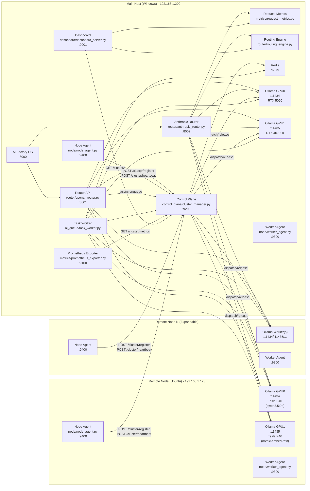

# AI Inference Hub v4

AI Inference Hub is a local AI datacenter control plane that runs with AI Factory OS on the same LAN.
It provides:

- OpenAI-compatible API routing (`/v1/chat/completions`, `/v1/responses`, `/v1/models`, `/v1/embeddings`, `/v1/rerank`)
- Multi-GPU and multi-node worker registration
- GPU-aware scheduling and async task queue
- Monitoring endpoints and a web dashboard

## Current Runtime Architecture

## Architecture Diagram



Node count is horizontally scalable: any number of remote nodes can join by running worker/node agents and registering to the same control plane.

### Control Plane
- `control_plane/cluster_manager.py` (port `9200`)
  - Node/worker registration
  - Scheduler dispatch/release
  - Queue APIs and task prune APIs
  - Metrics snapshot APIs

### GPU discovery behavior
- NVIDIA/Linux/Windows nodes: query via `nvidia-smi`
- macOS Apple Silicon nodes: fallback to MPS profile
  - memory: unified memory total (MB)
  - utilization/temperature/power: parsed from `powermetrics` when available
  - if `powermetrics` is unavailable or permission-limited, utilization/temperature/power fall back to `0`

### Router API
- `router/openai_router.py` (port `8001`)
  - OpenAI-compatible endpoints
  - Provider routing (`ollama`, `ollama_cloud`, `openai`, `gemini`, `nvidia_nim`)
  - Streaming via SSE for chat completions
  - Async enqueue mode with task polling

- `router/anthropic_router.py` (port `8002`)
  - Anthropic-compatible endpoints (`POST /v1/messages`)
  - Capability-based routing via `router/routing_engine.py`
  - Request metrics tracking via `metrics/request_metrics.py`
  - Full feature support: Extended Thinking, Prompt Caching, Tools, Vision

### Node Services
- `node/worker_agent.py` (default port `9300`)
  - Local Ollama worker discovery and health
- `node/node_agent.py` (default port `9400`)
  - GPU discovery + worker discovery
  - register/heartbeat to control plane

### Queue Worker
- `ai_queue/task_worker.py`
  - Consumes async tasks from Redis queue
  - Executes provider call
  - Writes task status and result

### Monitoring and UI
- `metrics/prometheus_exporter.py` (port `9100`, endpoint `/metrics`)
- `dashboard/dashboard_server.py` (port `9001`, page `/`, API `/api/overview`, `/api/task/{task_id}`)
  - Ops-first overview: alerts and health signals are near the top of the page.
  - Providers & Routing: provider health, request metrics, local-only mode, model overrides, routing audit log, and model alias map.
  - Model Alias Map shows the full route from Claude/Gateway model name to AIIH alias, target model, provider, worker or cloud adapter, and capabilities.

Dashboard authentication is optional and disabled by default for local development. Enable it before exposing the dashboard beyond a trusted local network:

```bash
AIIH_DASHBOARD_AUTH_ENABLED=true
AIIH_DASHBOARD_AUTH_USERNAME=admin
AIIH_DASHBOARD_AUTH_PASSWORD=change-me
```

When enabled, browser users sign in at `/login`. HTTP Basic Auth is still accepted for scripts and probes. `/health`, `/api/health`, and `/favicon.ico` remain unauthenticated for monitoring and browser compatibility.

## Fixed Ports

| Service | Port |
| --- | --- |
| AI Factory OS | `8000` |
| Router API (OpenAI) | `8001` |
| Router API (Anthropic) | `8002` |
| Dashboard | `9001` |
| Prometheus Exporter | `9100` |
| Control Plane API | `9200` |
| Worker RPC | `9300` |
| Node Agent | `9400` |
| Ollama Worker GPU0 | `11434` |
| Ollama Worker GPU1 | `11435` |
| Ollama Worker GPU0 (alt) | `11436` |
| Ollama Worker GPU1 (alt) | `11437` |

## Verified Directory Layout

```text
ai_inference_hub/
  ai_queue/
  cluster/
  config/
  control_plane/
  dashboard/
  metrics/
  node/
  providers/
  router/
  profiles/
    control-plane/
    worker-node/
  launchd/
  scripts/
  systemd/
  .env.example
  README.md
  requirements.txt
```

## API Surface (Implemented)

### Router (`8001`)
- `GET /health`
- `POST /v1/chat/completions` (supports `stream=true`)
- `POST /v1/responses`
- `GET /v1/models`
- `POST /v1/embeddings`
- `POST /v1/rerank`

### Anthropic Router (`8002`)
- `GET /health`
- `POST /v1/messages` (supports `stream=true`, Anthropic Messages API format)
- `GET /v1/models`

Fully compatible with Claude Code CLI and Claude Desktop. Configure with:
```
baseUrl: "http://127.0.0.1:8002/v1"
apiKey: "local-dev-key"
```

For Claude Desktop gateway-safe model names, configure aliases in `config/routing_rules.yaml`:

```yaml
model_aliases:
  alias_prefix: AIIH
  entries:
    glm-4.7-flash-q4: glm-4.7-flash:q4_K_M
    gemma4-e4b: gemma4:e4b
```

External Anthropic clients can then request `anthropic/AIIH/glm-4.7-flash-q4`; AIIH resolves it to the real model name before routing. If Claude Desktop runs on the same host as AIIH, use `http://127.0.0.1:8002`. If Claude Desktop runs on another machine, use the AIIH host LAN address, for example `http://192.168.1.200:8002`.

Supported Anthropic features:
- **Tools**: `tools` definition, `tool_choice` (auto/any/tool), `tool_result` with `is_error`
- **Extended Thinking**: `thinking` blocks, `budget_tokens`, streaming `thinking_delta`
- **Prompt Caching**: `cache_control` on text, image, tool_result, and document blocks
- **Vision**: `image` blocks with `base64`, `url`, `media_type`, `detail` support
- **Documents**: `document` blocks converted to text hints
- **Audio Input**: `audio` / `input_audio` blocks are translated to OpenAI-compatible `input_audio` when base64 data is present, or to explicit audio hints for text-only providers
- **Capability Gating**: Requests are inspected for `chat`, `tools`, `thinking`, `vision`, and `audio` needs before routing; exact model matches that lack a required capability are skipped in favor of a compatible local Ollama fallback when available
- **Assistant Prefill**: assistant role with content as prefill hint
- **Computer Use / Bash**: non-function tools mapped as function wrappers
- **Parameters**: `max_tokens`, `temperature`, `top_p`, `top_k`, `stop_sequences`
- **Error mapping**: rate_limit, invalid_request, overloaded, api_error
- **Headers**: `X-Request-Id`, `Retry-After`, rate limit headers

### Control Plane (`9200`)
- `GET /health`
- `POST /cluster/register`
- `POST /cluster/heartbeat`
- `GET /cluster/nodes`
- `GET /cluster/workers`
- `GET /cluster/gpu`
- `GET /cluster/tasks`
- `GET /cluster/tasks/{task_id}`
- `POST /cluster/tasks`
- `POST /cluster/tasks/prune`
- `POST /cluster/dispatch`
- `POST /cluster/release`
- `POST /cluster/telemetry`
- `GET /cluster/metrics`
- `GET /cluster/models`

### Dashboard (`9001`)
- `GET /health`
- `GET /api/health`
- `GET /api/providers/health`
- `GET /api/overview`
- `GET /api/task/{task_id}`
- `GET /api/metrics/requests`
- `GET /api/metrics/requests/recent`
- `GET /api/metrics/providers`
- `GET /api/metrics/provider-diagnostics`
- `GET /api/routing/status`
- `POST /api/routing/overrides`
- `DELETE /api/routing/overrides/{model}`
- `POST /api/routing/local-only/enable`
- `POST /api/routing/local-only/disable`
- `POST /api/providers/{provider}/enable`
- `POST /api/providers/{provider}/disable`
- `POST /api/providers/{provider}/probe`

### Metrics Exporter (`9100`)
- `GET /health`
- `GET /metrics`

### Node Services
- Worker agent: `GET /health`, `GET /workers`, `GET /rpc/ping`
- Node agent: `GET /health`, `GET /status`, `POST /register-now`

## Routing and Scheduling Rules

### Provider selection
- Gateway-safe model aliases are resolved first. For example, `anthropic/AIIH/glm-4.7-flash-q4` is stripped to `AIIH/glm-4.7-flash-q4`, resolved through `config/routing_rules.yaml`, then routed as `glm-4.7-flash:q4_K_M`.
- Model provider is resolved from `config/models.yaml`.
- Fallback by model name prefix:
  - `*-*-cloud`, `*-*-cloud-latest` -> `ollama_cloud`
  - `gemini*` -> `gemini`
  - `gpt*`, `o1*`, `o3*`, `o4*` -> `openai`
  - `meta/`, `mistralai/`, `nvidia/`, `nemotron*`, etc. -> `nvidia_nim`
  - else -> `ollama`

### Worker assignment
- Scheduler picks from healthy workers using:
  1. lowest GPU utilization
  2. lowest queue size
  3. randomized tie-break
- **Proactive Diversion**: Workers are excluded if their GPU utilization is `>= 85%` or their queue exceeds `AIIH_MAX_WORKER_QUEUE`.

#### Hierarchical Fallback (Tiered Reliability)
To maintain responsiveness under load, the Router implements a tiered fallback chain:
- **Tier 1 (S-Tier)**: High-performance GPU (RTX 5090)
- **Tier 2 (A-Tier)**: Mid-performance GPU (RTX 4070 Ti Super)
- **Tier 3 (B-Tier)**: High-capacity GPU (Tesla P40)

When the S-Tier is saturated (GPU `>= 85%`), requests are proactively diverted to A-Tier models, and then to B-Tier as a final safety net.

### Model-to-worker mapping
- Preferred: `worker_bindings` (`node_id` + `port`)
- Legacy fallback: `worker_ports`
- `config/cluster.yaml` `node_hosts` maps a `node_id` to the host AIIH uses to reach that worker. If AIIH and Ollama run on the same machine, keep the binding local:

```yaml
local_node_id: node-01
node_hosts:
  node-01: 127.0.0.1
```

Do not use `node_hosts` for the Claude Desktop gateway address. Remote clients should point to the AIIH router URL instead, such as `http://192.168.1.200:8002`.

## Sync vs Async Request Flow

### Sync (default)
`POST /v1/chat/completions` without async flags:
- router asks control plane `/cluster/dispatch`
- assigned worker serves request
- router posts `/cluster/release` and `/cluster/telemetry`

### Async queue mode
Set any of these in request body:
- `"async": true`
- `"background": true`
- `"queue": true`

Then router enqueues task through `/cluster/tasks` and returns:
- `status=queued`
- `task_id`
- `poll_url` (control plane `/cluster/tasks/{task_id}`)

Task worker (`python -m ai_queue.task_worker`) later executes and updates task status/result.

## Environment and Configuration

### `.env` source of truth
- **Single source**: project root `.env.example`
- Generated profile templates:
  - `profiles/control-plane/.env.example`
  - `profiles/worker-node/.env.example`
- Regenerate after editing root template:

```bash
python scripts/sync_env_examples.py
```

### Key env vars
- `AIIH_HOST`
- `AIIH_ROUTER_PORT`, `AIIH_ANTHROPIC_PORT`, `AIIH_DASHBOARD_PORT`, `AIIH_METRICS_PORT`, `AIIH_CONTROL_PORT`
- `AIIH_CONTROL_URL`, `AIIH_ROUTER_URL`, `AIIH_METRICS_URL`
- `AIIH_REDIS_URL`
- `AIIH_NODE_ID`, `AIIH_NODE_IP`
- `AIIH_WORKER_RPC_PORT`, `AIIH_NODE_PORT`
- `AIIH_HEARTBEAT_INTERVAL`, `AIIH_STALE_AFTER`, `AIIH_REQUEST_TIMEOUT`
- `AIIH_MAX_WORKER_QUEUE`, `AIIH_MAX_TASK_RETRIES`
- `AIIH_WORKER_DEGRADE_AFTER_ERRORS`, `AIIH_WORKER_DEGRADE_COOLDOWN`
- `AIIH_PROVIDER_COOLDOWN`
- `AIIH_DASHBOARD_REFRESH`
- `AIIH_CONFIG_DIR` (optional override for config files and runtime routing state)
- `AIIH_DETAIL_REFRESH`
- `AIIH_TASK_PRUNE_ENABLED`, `AIIH_TASK_PRUNE_HOUR`, `AIIH_TASK_PRUNE_MINUTE`
- `AIIH_TASK_RETENTION_HOURS`, `AIIH_TASK_PRUNE_STATUSES`
- `AIIH_DEBUG_TOOL_CALLS`
- `OPENAI_API_BASE`, `OPENAI_API_KEY`
- `GEMINI_API_BASE`, `GEMINI_API_KEY`
- `NVIDIA_NIM_API_BASE`, `NVIDIA_NIM_API_KEY`
- `NVIDIA_NIM_TIMEOUT`, `NVIDIA_NIM_MIN_INTERVAL`
- `OLLAMA_CLOUD_API_BASE`, `OLLAMA_CLOUD_API_KEY`
- `AIIH_OLLAMA_FALLBACK_MODEL`, `AIIH_OLLAMA_FALLBACK_BASE_URL`

### Config files
- `config/models.yaml`: model registry and worker bindings
- `config/cluster.yaml`: local cluster defaults
- `config/routing_rules.yaml`: baseline model routing rules, gateway-safe `model_aliases`, `fallback.ollama_default_model`, and optional `fallback.ollama_base_url`
- `config/routing_state.yaml`: local runtime Dashboard routing state, generated automatically and ignored by Git
- `config/routing_audit.jsonl`: local runtime Dashboard routing audit log, generated automatically and ignored by Git

## Startup

### Windows quick start
1. Start Ollama workers
2. Start Redis
3. Run:

```bat
scripts\start_all.bat
```

This launches:
- control plane
- worker agent
- node agent
- async task worker
- router
- metrics exporter
- dashboard

Windows `.bat` scripts auto-load root `.env` via `scripts/load_env.bat`.

`scripts/start_all.bat` now includes a health-gate check (up to 90s) after launch.
It verifies:
- `http://127.0.0.1:9200/health`
- `http://127.0.0.1:8001/health`
- `http://127.0.0.1:9100/health`
- `http://127.0.0.1:9001/health`

When all pass, it prints `[PASS]`. If timeout occurs, it prints per-endpoint `[OK]/[FAIL]` diagnostics.
### Windows overload validation (429 behavior)
Use this to verify same-model concurrency returns explicit `429 + Retry-After` instead of client-side network errors.

```bat
scripts\stress_429_check.bat
```

Optional tuning:

```bat
scripts\stress_429_check.bat --model qwen3.5:27b --total 40 --concurrency 12
```

Expected result:
- mix of `200` and `429`
- `retry_after_headers` present
- no `network_errors`

### One-line restart commands (host/Ubuntu/macOS)

Windows host (PowerShell):

```powershell
cd /d D:\Ai\ai_inference_hub; .\scripts\start_all.bat
```

Ubuntu node (systemd):

```bash
sudo systemctl restart aiih-ollama-gpu0 aiih-ollama-gpu1 aiih-worker-agent aiih-node-agent
```

macOS node (project scripts):

```bash
cd ~/ai/ai_inference_hub && bash scripts/stop_cluster_macos.sh && bash scripts/start_cluster_macos.sh
```

macOS node (launchd, if configured):

```bash
launchctl kickstart -k gui/$(id -u)/com.aiih.node
```

### Ubuntu remote node quick start
Use for remote GPU workers (for example Tesla P40 node).

1. Prepare `.env` from profile:
```bash
cp profiles/worker-node/.env.example .env
```
2. Fill host IPs and unique node identity.
3. Start two Ollama workers (example):
```bash
CUDA_VISIBLE_DEVICES=0 OLLAMA_HOST=0.0.0.0:11434 ollama serve
CUDA_VISIBLE_DEVICES=1 OLLAMA_HOST=0.0.0.0:11435 ollama serve
```
4. Start node services:
```bash
./scripts/start_cluster.sh
```

Note: `scripts/start_cluster.sh` does **not** parse `.env` automatically.
For automatic env loading and reboot persistence, prefer systemd units in `systemd/` + `/etc/default/*`.

### macOS node (Apple Silicon MPS) deployment

Use mac mini M4 (64GB) as a **large-memory model pool**:
- keep a single Ollama worker on `11434`
- bind models that NVIDIA nodes cannot host reliably due to VRAM limits
- keep primary high-throughput chat on NVIDIA nodes

#### 1. Prepare project and Python environment on macOS

```bash
cd ~/ai/ai_inference_hub
python3 -m venv .venv
source .venv/bin/activate
pip install -r requirements.txt
```

#### 2. Prepare macOS node `.env`

```bash
cp profiles/worker-node/.env.example .env
```

Edit `.env`:

```env
AIIH_HOST=0.0.0.0
AIIH_NODE_ID=node-macm4-01
AIIH_NODE_IP=<MAC_LAN_IP>
AIIH_CONTROL_URL=http://<CONTROL_PLANE_HOST_IP>:9200
AIIH_ROUTER_URL=http://<CONTROL_PLANE_HOST_IP>:8001
AIIH_METRICS_URL=http://<CONTROL_PLANE_HOST_IP>:9100
AIIH_WORKER_RPC_PORT=9300
AIIH_NODE_PORT=9400
AIIH_REDIS_URL=redis://<REDIS_HOST_IP>:6379/0
```

#### 3. Ensure Ollama is running on `11434`

If Ollama is already running normally on macOS, keep it as-is.
Verify:

```bash
curl http://127.0.0.1:11434/api/tags
```

#### 4. Start macOS node services

One-command start:

```bash
chmod +x scripts/start_cluster_macos.sh scripts/stop_cluster_macos.sh
./scripts/start_cluster_macos.sh
```

Stop services:

```bash
./scripts/stop_cluster_macos.sh
```

Manual mode (two terminals):

```bash
source .venv/bin/activate
set -a; source .env; set +a
python -m uvicorn node.worker_agent:app --host 0.0.0.0 --port 9300
```

Open another terminal:

```bash
cd ~/ai/ai_inference_hub
source .venv/bin/activate
set -a; source .env; set +a
python -m uvicorn node.node_agent:app --host 0.0.0.0 --port 9400
```

#### 5. Optional: macOS login auto-start (launchd)

Template file:
- `launchd/com.aiih.node.plist.example`

Install:

```bash
mkdir -p ~/Library/LaunchAgents
ROOT_DIR="$HOME/ai/ai_inference_hub"
sed "s|__ROOT_DIR__|$ROOT_DIR|g" launchd/com.aiih.node.plist.example > ~/Library/LaunchAgents/com.aiih.node.plist
launchctl unload ~/Library/LaunchAgents/com.aiih.node.plist 2>/dev/null || true
launchctl load ~/Library/LaunchAgents/com.aiih.node.plist
```

Control:

```bash
launchctl start com.aiih.node
launchctl stop com.aiih.node
launchctl unload ~/Library/LaunchAgents/com.aiih.node.plist
```

#### 6. Register model binding on control-plane host

Example binding in `config/models.yaml`:

```yaml
- name: gpt-oss:120b
  provider: ollama
  worker_bindings:
    - node_id: node-macm4-01
      port: 11434
  capabilities: [chat, responses, tools]
```

#### 7. Validate from control-plane host

```powershell
curl http://127.0.0.1:9200/cluster/nodes
curl http://127.0.0.1:9200/cluster/workers
curl http://127.0.0.1:9200/cluster/models
```

You should see `node-macm4-01` and worker `node-macm4-01:11434`.

## systemd Assets

Included templates:
- `systemd/aiih-worker-agent.service`
- `systemd/aiih-node-agent.service`
- `systemd/aiih-ollama-gpu0.service`
- `systemd/aiih-ollama-gpu1.service`

Included env examples:
- `profiles/worker-node/ollama-gpu0.env.example`
- `profiles/worker-node/ollama-gpu1.env.example`
- `profiles/worker-node/node-p40-01.env.example`

If default single `ollama.service` exists on Ubuntu, disable/mask it before dual-worker setup to avoid conflicts.

### Prevent default `ollama.service` from coming back after upgrade

After `ollama` package upgrades, Ubuntu may recreate and re-enable `ollama.service`.
If you are using `aiih-ollama-gpu0.service` / `aiih-ollama-gpu1.service`, run:

```bash
sudo systemctl disable --now ollama
sudo systemctl mask --force ollama
```

Verify it is inactive/masked:

```bash
systemctl list-unit-files | grep '^ollama.service'
sudo systemctl status ollama --no-pager -l
```

Optional hard removal (only if you do not want default unit file on this node):

```bash
sudo rm -f /etc/systemd/system/ollama.service
sudo systemctl daemon-reload
sudo systemctl reset-failed
```

Then ensure AIIH services are active:

```bash
sudo systemctl restart aiih-ollama-gpu0 aiih-ollama-gpu1 aiih-worker-agent aiih-node-agent
sudo systemctl status aiih-ollama-gpu0 aiih-ollama-gpu1 aiih-worker-agent aiih-node-agent --no-pager -l
```

## Monitoring and Metrics

Control plane metrics snapshot includes:
- `request_total`
- `request_latency_ms_avg`
- `request_latency_ms_p95`, `request_latency_ms_p99`
- `endpoint_latency`, `endpoint_model_latency`
- `worker_usage`
- `queue_length`
- `model_usage`
- `endpoint_usage`
- `provider_status`
- `error_count`
- `error_code_usage`
- `redis_backend` (`redis` or `memory`)

Common `error_code` values from router:
- `provider_timeout`
- `runner_stopped`
- `provider_unreachable`
- `worker_unavailable`
- `control_plane_unavailable`
- `control_plane_error`
- `queued_sync_not_supported`
- `bad_request`

Prometheus exporter exposes transformed metrics at `/metrics`.

Dashboard Workers table also shows `ollama /api/ps` runtime summary per worker (active model count, active model names, processor hints) when the node can query local Ollama.

Dashboard top metrics includes `Vision Errors (5m)` (error rate and failed/total count for `qwen3-vl:8b`) and Alerts now raises a warning when 5-minute vision error rate is high.

Dashboard also shows **Cloud Providers** health status for all configured external APIs (NVIDIA NIM, Ollama Cloud, OpenAI, Gemini), displaying connection status, available model count, and API latency.

Dashboard **Model Alias Map** shows:
- Gateway model, for example `anthropic/AIIH/glm-4.7-flash-q4`
- AIIH alias, for example `AIIH/glm-4.7-flash-q4`
- Target model, provider, worker or cloud adapter, and capabilities

Local Ollama aliases display the actual worker URL, such as `http://127.0.0.1:11434`. Cloud aliases display `cloud adapter @ <base_url>` and append `(API key missing)` when the required provider credential is not present.

### Request Metrics & Model Routing
- **Request Metrics** (`metrics/request_metrics.py`)
  - Tracks per-request: tokens (input/output), latency, provider routing, streaming status, errors
  - Per-provider breakdown: requests, error rate, avg latency, token counts
  - Dashboard displays 4 summary cards + per-provider metrics table

- **Model Routing Engine** (`router/routing_engine.py`)
  - Capability-based provider scoring (chat, thinking, tools, vision, audio, embeddings)
  - Health-aware routing (unhealthy providers penalized)
  - Latency-aware routing (high latency providers downweighted)
  - Explicit local fallback model/base URL via `fallback.ollama_default_model` and `fallback.ollama_base_url` in `config/routing_rules.yaml`
  - Cloud provider 429/503/504/timeout fallback to local Ollama for Anthropic and OpenAI-compatible chat paths
  - Provider cooldown after transient cloud failures, configurable via `AIIH_PROVIDER_COOLDOWN`; cooldown providers are skipped until probe/success clears them or the timer expires.
  - Agent-friendly NIM throttling: 1-by-1 provider queue, configurable `NVIDIA_NIM_MIN_INTERVAL`, and `NVIDIA_NIM_TIMEOUT` defaulting to 120s for cold starts before local fallback
  - Gateway-safe model aliases with configurable `alias_prefix`; clients can request `anthropic/<prefix>/<alias>` while AIIH routes the real model name.
  - Model overrides (force specific model → specific provider)
  - Configurable rules in `config/routing_rules.yaml`
  - Runtime provider enable/disable and model overrides persist in `config/routing_state.yaml`
  - Routing control changes are recorded in `config/routing_audit.jsonl`
  - Dashboard UI: provider enable/disable toggles, local-only mode, model override controls, model alias map, and routing audit log

## Validation Checklist

From control-plane host:

```powershell
curl http://127.0.0.1:9200/cluster/nodes
curl http://127.0.0.1:9200/cluster/workers
curl http://127.0.0.1:9200/cluster/gpu
curl http://127.0.0.1:8001/v1/models
```

Cross-platform per-worker Ollama binding test (Windows/macOS/Linux):

```bash
OLLAMA_HOST=http://127.0.0.1:11434 ollama list
OLLAMA_HOST=http://127.0.0.1:11435 ollama list
```

Chat smoke test:

```powershell
curl http://127.0.0.1:8001/v1/chat/completions ^
  -H "Content-Type: application/json" ^
  -H "Authorization: Bearer local-dev-key" ^
  -d "{\"model\":\"qwen3.5:27b\",\"messages\":[{\"role\":\"user\",\"content\":\"hello\"}]}"
```


Embeddings smoke test:

```powershell
curl http://127.0.0.1:8001/v1/embeddings ^
  -H "Content-Type: application/json" ^
  -H "Authorization: Bearer local-dev-key" ^
  -d "{\"model\":\"nomic-embed-text:latest\",\"input\":\"embedding smoke test\"}"
```
Rerank smoke test:

```powershell
curl http://127.0.0.1:8001/v1/rerank ^
  -H "Content-Type: application/json" ^
  -H "Authorization: Bearer local-dev-key" ^
  -d "{\"model\":\"bbjson/bge-reranker-base:latest\",\"query\":\"gpu scheduling\",\"documents\":[\"ai inference\",\"database tuning\",\"gpu queue balancing\"],\"top_n\":2}"
```
Async smoke test:

```powershell
curl http://127.0.0.1:8001/v1/chat/completions ^
  -H "Content-Type: application/json" ^
  -H "Authorization: Bearer local-dev-key" ^
  -d "{\"model\":\"qwen3.5:27b\",\"async\":true,\"messages\":[{\"role\":\"user\",\"content\":\"run async\"}]}"
```

Then poll returned `task_id`:

```powershell
curl http://127.0.0.1:9200/cluster/tasks/<TASK_ID>
```

### Baseline (March 17, 2026)

Quick baseline on control-plane host (`http://127.0.0.1:8001`) with current cluster bindings:

- `qwen3.5:27b` -> `node-01:11434` (`192.168.1.200`)
- `qwen3-vl:8b` -> `node-01:11435` (`192.168.1.200`)
- `nomic-embed-text:latest` -> `node-p40-01:11435` (`192.168.1.123`)

Latency snapshot (5 runs, sync API):

| API | Model | p50 | p95 | avg | Result |
|---|---|---:|---:|---:|---|
| `/v1/chat/completions` | `qwen3.5:27b` | 1171.55 ms | 1173.06 ms | 1220.15 ms | pass |
| `/v1/embeddings` | `nomic-embed-text:latest` | 139.78 ms | 142.64 ms | 138.69 ms | pass |
| `/v1/chat/completions` (vision payload) | `qwen3-vl:8b` | - | - | - | failed (`502`, model runner stopped) |

Vision worker troubleshooting when baseline fails with `502`:

```bash
curl http://127.0.0.1:9200/cluster/workers
# check status of node-01:11435 (qwen3-vl:8b)
```

```bash
# on vision worker host
OLLAMA_HOST=http://127.0.0.1:11435 ollama ps
OLLAMA_HOST=http://127.0.0.1:11435 ollama list
```

## AI Factory OS Integration

AI Factory OS stays on `8000`.
AI Inference Hub router is on `8001` with OpenAI-compatible API format.
AI Factory OS can call router endpoints and read control-plane/dashboard telemetry for orchestration.

---

## Maintenance Log

### 2026-04-18

- Fix `providers/ollama_adapter.py` syntax error (duplicate code fragment causing `SyntaxError: '(' was never closed`)
- Clear Python cache to resolve persistent import issues
- Restore dashboard styling with full CSS (create `dashboard/static/style.css` and add static routes)
- Add `dashboard/static/` directory for serving CSS assets
- **HTTP Connection Pooling**: Add shared session with connection pool (`providers/http_client.py`)
  - All providers (ollama, openai, gemini) use pooled connections
  - Router and Dashboard use pooled connections to control plane
  - Configurable via `AIIH_HTTP_POOL_CONNECTIONS`, `AIIH_HTTP_POOL_MAXSIZE`, `AIIH_HTTP_MAX_RETRIES`
- **Rate Limiting**: Add per-IP rate limiting middleware (`router/rate_limiter.py`)
  - Token bucket implementation per client IP
  - Enable via `AIIH_RATE_LIMIT_ENABLED=true`
  - Configurable via `AIIH_RATE_LIMIT_PER_MINUTE`, `AIIH_RATE_LIMIT_BURST`
- **Multi Task Worker**: Support multiple async workers for parallel processing
  - Each worker has unique `AIIH_TASK_WORKER_ID`
  - Run multiple instances: `scripts\start_task_worker.bat` with different worker IDs
  - Workers use shared HTTP session for better performance
- **Dashboard Health API**: Add `/api/health` endpoint for monitoring systems
  - Returns detailed health status with cluster, workers, and queue info
  - Suitable for Kubernetes liveness/readiness probes
- **Dashboard Charts**: Add real-time latency and request rate charts
  - Latency trend line chart (5min window)
  - Request rate bar chart (5min window)
  - GPU Utilization multi-line chart (per worker)
  - Model usage doughnut chart
  - Worker load horizontal bar chart
  - Latency distribution bar chart (P50/P95/P99)
- **Performance Charts**: Tokens/sec, Time to First Token, GPU Memory, Power Draw, Temperature

### 2026-05-05

- **Chinese Encoding Fix**: Harden Claude Code / Claude Desktop Chinese output paths against mojibake.
  - Anthropic SSE streams use `ensure_ascii=True` so reverse proxies and charset-unaware clients receive ASCII-safe event payloads.
  - Anthropic non-streaming JSON and error responses use ASCII-safe JSON rendering with an explicit UTF-8 content type.
  - OpenAI, NVIDIA NIM, and Gemini adapters force upstream HTTP responses to UTF-8 before parsing streamed lines or JSON bodies.
- **Tool-call Normalization**: Harden Anthropic-compatible tool-use output from non-Anthropic providers.
  - `router/content_blocks.py` centralizes Anthropic/OpenAI/Ollama content-part conversion for text, images, documents, tool results, thinking hints, and audio placeholders.
  - `router/capabilities.py` derives routing requirements from Anthropic and OpenAI request payloads so multimodal/tool requests do not get sent to a model that cannot handle them.
  - `router/tool_call_normalizer.py` converts OpenAI `tool_calls`, Anthropic/raw `tool_use`, `<tool_use>` wrappers, and Python-dict-like provider text into one internal tool-call shape.
  - OMLX-inspired fallback parsing covers Qwen/Llama `<function=...><parameter=...>`, GLM `<arg_key>/<arg_value>`, namespaced `<*:tool_call>`, bracketed `[Tool call: ...]`, and Gemma-style `call:name{...}` markup.
  - Tool markup inside `<think>...</think>` is ignored during normal content parsing; thinking-only tool calls are executable only through the guarded parser and only when the request declared the tool.
  - Anthropic non-streaming and SSE responses now suppress raw tool JSON before it reaches Claude Code.
  - Tools are forwarded as Anthropic `tool_use` only when the original request declared that tool; undeclared provider-generated tools are silently suppressed and logged so they cannot trigger tool retry loops.
  - `router/server_tool_policy.py` detects Anthropic server tools (`web_search` / `web_fetch`) before routing. OpenAI-compatible providers such as NVIDIA NIM and Ollama do not receive those tools as fake functions; unsupported server-tool requests are rejected before they can cause repeated WebSearch loops.
  - `AIIH_SERVER_TOOL_MODE` controls server-tool ownership: `reject` blocks unsupported upstream server tools, `local` lets AIIH handle forced `web_search` / `web_fetch`, and `passthrough` leaves them to Claude Code/runtime client search.
  - `AIIH_WEB_SERVER_TOOLS_ENABLED=true` is a compatibility alias for local mode and enables AIIH-local `web_search` / `web_fetch` handling for requests that explicitly force those tools with `tool_choice`; otherwise these server tools are rejected before upstream routing.
  - `router/anthropic_sse_builder.py` centralizes Anthropic SSE content-block state for text, thinking, and tool-use streaming, including buffered tool arguments that arrive before a tool name.

### Smart Load Balancing
- **Tier-based distribution**: 5090 (60%) > 4070Ti (30%) > P40 (10%)
- **Model affinity**: Prefer workers with model already loaded
- **Hybrid strategy**: least-loaded (low load) + round-robin (high load)

### Fault Tolerance
- **GPU failure detection**: Heartbeat timeout → dead status
- **Task requeue**: Dead worker tasks requeued to available workers
- **Multi-layer fallback**: Model A → Model B → queue → error
- **Circuit Breaker**: CLOSED → OPEN → HALF_OPEN for provider calls

### Structured Logging
- **JSON format**: Machine-parseable logs
- **Correlation IDs**: Request tracing
- **Configurable**: Via AIIH_LOG_JSON, AIIH_LOG_LEVEL

### External Cloud Providers
- **NVIDIA NIM**: `providers/nvidia_nim_adapter.py`
  - Base URL: `https://integrate.api.nvidia.com/v1` (configurable via `NVIDIA_NIM_API_BASE`)
  - Auth: Bearer token via `NVIDIA_NIM_API_KEY`
  - Supported endpoints: chat, stream, responses, embeddings, rerank
  - Free-tier safety: serialized requests via `NVIDIA_NIM_MIN_INTERVAL` and 120s default timeout via `NVIDIA_NIM_TIMEOUT`, allowing slow cold starts to complete while still falling back on real timeouts.
  - Auto-detected models: `meta/`, `mistralai/`, `nvidia/`, `google/`, `microsoft/`, `baichuan-inc/`, `deepseek/`, `upstage/`, `snowflake/`, `ibm/`, `yola/`, `writer/`, `nemotron*`

- **Ollama Cloud**: `providers/ollama_cloud_adapter.py`
  - Base URL: `https://ollama.com` (configurable via `OLLAMA_CLOUD_API_BASE`)
  - Auth: Bearer token via `OLLAMA_CLOUD_API_KEY`
  - Supported endpoints: chat, stream, responses, embeddings, rerank
  - Auto-detected models: names ending with `-cloud` or `-cloud-latest`

Both providers follow the same `ProviderAdapter` interface, making it easy to add new cloud providers in the future.

### Anthropic-Compatible API
- **Anthropic Router**: `router/anthropic_router.py` (port `8002`)
  - Full Anthropic Messages API format (`POST /v1/messages`)
  - Compatible with Claude Code CLI and Claude Desktop
  - Auto-converts Anthropic requests to OpenAI format for internal routing
  - Supports streaming with proper Anthropic SSE events
  - Normalizes provider tool calls and blocks undeclared raw tool payloads from leaking into chat output
  - Configure: `baseUrl: "http://127.0.0.1:8002/v1"`, `apiKey: "local-dev-key"`
  - **Full feature support**: Extended Thinking, Prompt Caching, Tools, Vision, Documents, Computer Use, Bash, Assistant Prefill, Rate Limit Headers, Error type mapping
- **Anthropic Streaming Fix**: Handle null `usage` fields in upstream provider chunks
- **Payload Validation Fix**: Strip `anthropic_beta`, `metadata`, `extra_body` from upstream payloads to prevent 400 Bad Request on strict OpenAI-compatible APIs (like NVIDIA NIM)

### Cloud Provider Health Monitoring
- Dashboard now shows Cloud Providers health status
- Auto-detects configured providers based on env var presence
- Displays connection status, model count, and API latency
- API: `GET /api/providers/health`

### Request Metrics & Model Routing
- **Request Metrics Collector** (`metrics/request_metrics.py`)
  - Per-request tracking: model, provider, latency, input/output tokens, streaming status, errors
  - Summary statistics: total requests, error rate, P50/P95/P99 latency, token ratios
  - Per-provider breakdown: request counts, error rates, avg latency, token totals
  - Dashboard UI: 4 summary cards + provider metrics table

- **Model Routing Engine** (`router/routing_engine.py`)
  - Capability-based scoring system with provider preference matrix
  - Health-aware routing (unhealthy providers get 70% score penalty)
  - Latency-aware routing (high latency providers downweighted)
  - Cloud provider 429/503/504/timeout fallback to local Ollama for Anthropic and OpenAI-compatible chat routes
  - Explicit local fallback model/base URL via `fallback.ollama_default_model` and `fallback.ollama_base_url`
  - Gateway-safe `model_aliases` with an optional `alias_prefix`
  - Model overrides: force specific models to specific providers
  - Configurable rules in `config/routing_rules.yaml`
  - Runtime provider enable/disable and model overrides persist in `config/routing_state.yaml`
  - Routing control changes are recorded in `config/routing_audit.jsonl`
  - Dashboard UI: provider enable/disable toggles, local-only mode, model override add/remove controls, model alias map, and cloud adapter labels
  - API endpoints for runtime control of routing behavior
